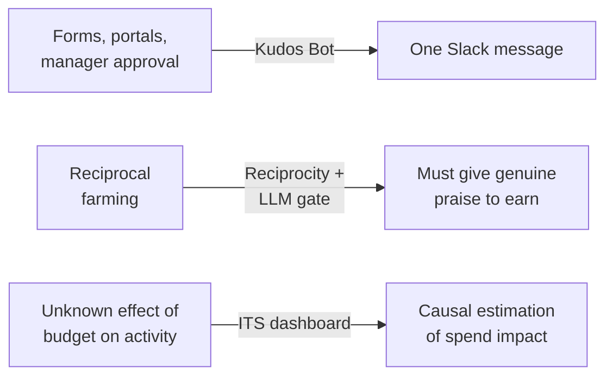
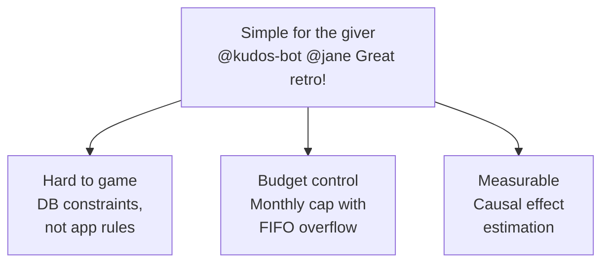
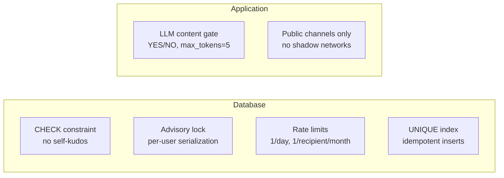
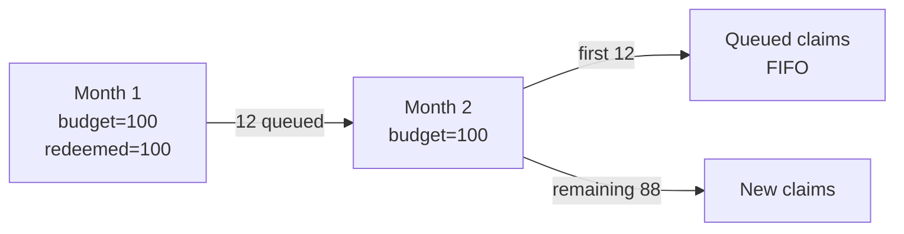
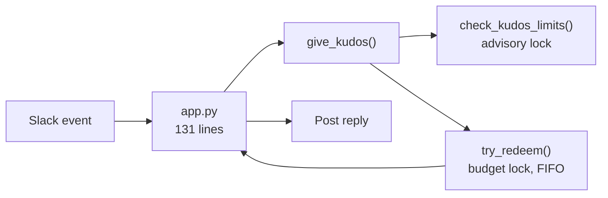
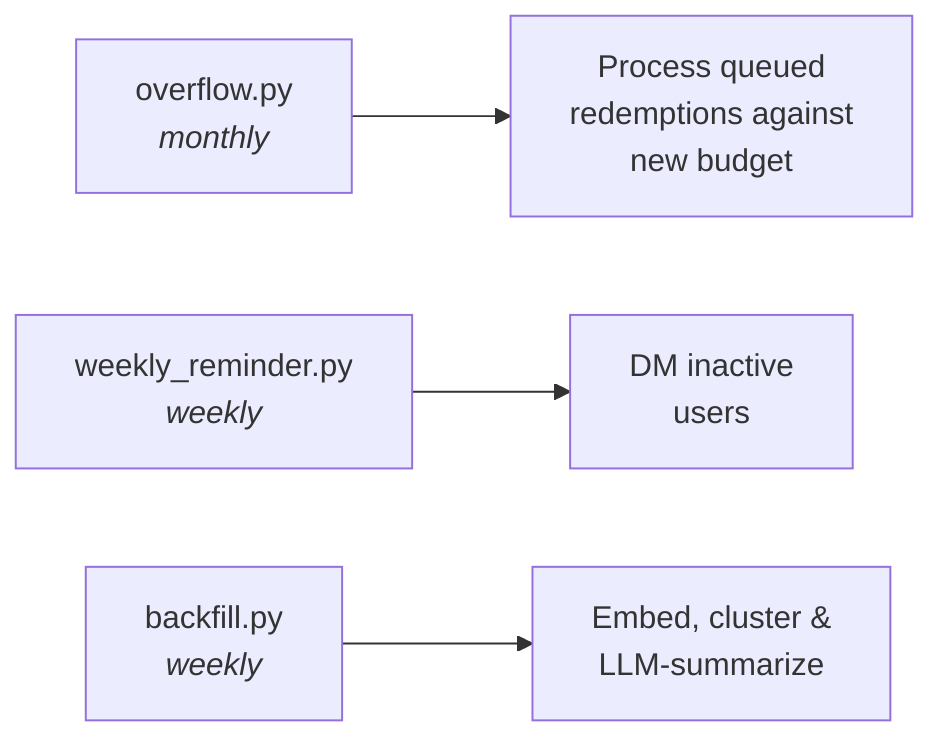
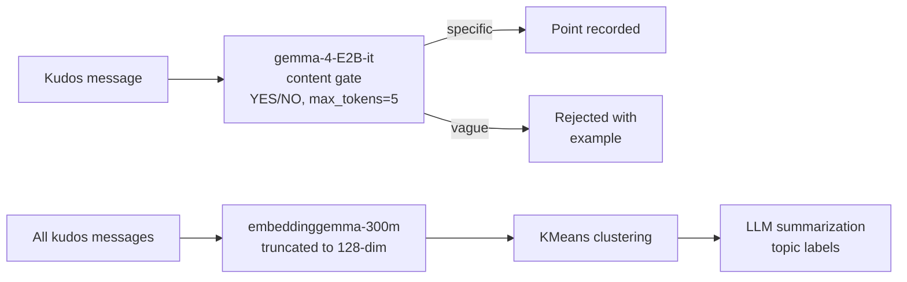

# Kudos Bot

Peer recognition programs fail when they're hard to use or easy to game. Kudos Bot makes giving praise as simple as a Slack message — and makes abuse structurally impossible rather than policy-dependent.

# The Problem

# Demo: Slack Bot

Live demo: onboarding, content check, edit-to-fix, error handling, and private channel rejection.

# Demo: Dashboard

Live demo: operational snapshot, usage & budget forecast, treatment effect plot, leaderboard, and topic drill-down.

# Design Principles

# Reciprocity: You Earn by Giving

Points convert to dollars only when your given count matches your received count.

$$\text{owed} = \min(\text{given},\, \text{received}) - \text{redeemed}$$

|       | Given | Received | Redeemed | Owed |
|-------|------:|---------:|---------:|-----:|
| Alice |     5 |        3 |        2 |    1 |
| Bob   |     1 |        8 |        1 |    0 |

Bob has 7 unredeemed kudos. He earns his next payout by recognizing someone else.

# Anti-Abuse: Defense in Depth

Every layer is enforced at the database or infrastructure level — not application code that can be bypassed.

# Budget Control

Accounting sets a monthly point budget and conversion rate. When the budget is exhausted, payouts queue FIFO rather than being rejected. Queued claims draw from the *next* month's budget first, before new claims.

Accounting is notified on the first rollover. A dashboard tracks queue depth over time so chronic underbudgeting is visible.

# Architecture

All business logic lives in Postgres functions. The Python app is a 131-line event router.

Edits delete the old point and re-evaluate from scratch. Deletions remove the point; if already redeemed, accounting is warned.

# Scheduled Jobs

# Treatment Effect Estimation

Assuming counterfactual stationarity, a Poisson GLM with successive difference contrasts estimates the causal effect of conversion-rate changes as incidence rate ratios. The same model forecasts next week's redemptions.

{height=45%}

# Topic Clustering

Kudos messages are embedded into 128-dim vectors using a truncated embedding model, then clustered with KMeans using inverse-log month-frequency weights so older high-volume months don't dominate.

$$w_i = \frac{1}{\ln(1 + c_{m_i})} \qquad k = n_{\text{months}} + 3$$
Representative messages (nearest 25% to centroid) are sampled and summarized by an LLM into topic labels. 

# Technology Stack

\begin{center}
\begin{tabular}{c@{\hspace{1.2em}}c@{\hspace{1.2em}}c@{\hspace{1.2em}}c@{\hspace{1.2em}}c}
\includegraphics[height=1.2cm]{logos/slack.png} &
\includegraphics[height=1.2cm]{logos/postgres.png} &
\includegraphics[height=1.2cm]{logos/python.png} &
\includegraphics[height=1.2cm]{logos/dash.png} &
\includegraphics[width=3cm]{logos/statsmodels.png} \\[4pt]
\small Slack & \small Postgres & \small Python & \small Dash & \small statsmodels \\[14pt]
\includegraphics[height=1.2cm]{logos/sklearn.png} &
\includegraphics[height=1.2cm]{logos/llamacpp.png} &
\includegraphics[height=1.2cm]{logos/gemma.png} &
\includegraphics[height=1.2cm]{logos/pgsd.png} & \\[4pt]
\small scikit-learn & \small llama.cpp & \small Gemma & \small pg-schema-diff &
\end{tabular}
\end{center}

# Lines of Code

722 lines total — bot, dashboard, cron jobs, schema, and all business logic.

| Component | Lines |
|-----------|------:|
| Python    |   514 |
| SQL       |   208 |
| **Total** | **722** |

# AI in Development

AI was used at every stage: critiquing the initial design, generating synthetic data (usernames, kudos messages, topic distributions), prototyping all code, tests and debugging, learning unfamiliar libraries (Dash), and writing this presentation.

# AI in the Product

The bot uses an LLM to gate every kudos for substantive content, and another to summarize topic clusters for the dashboard.
