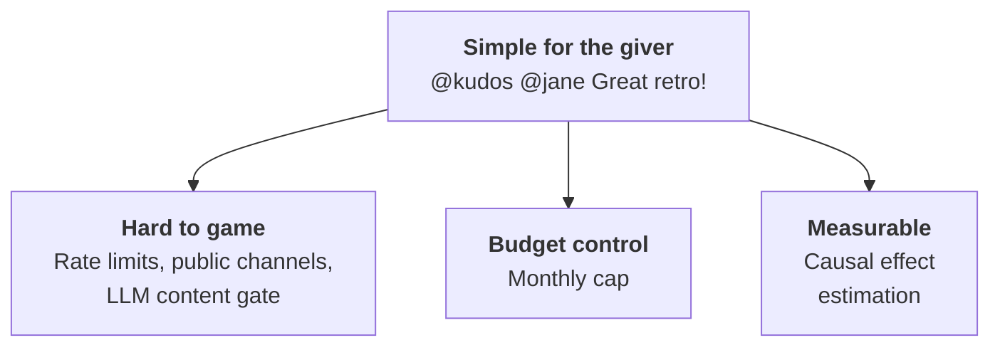
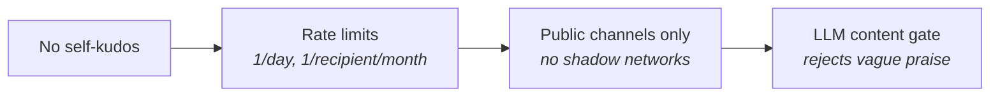
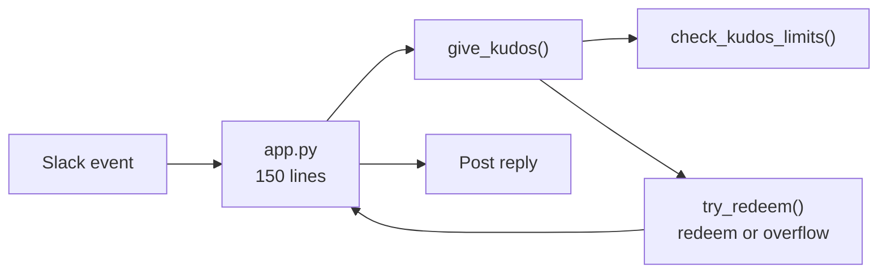
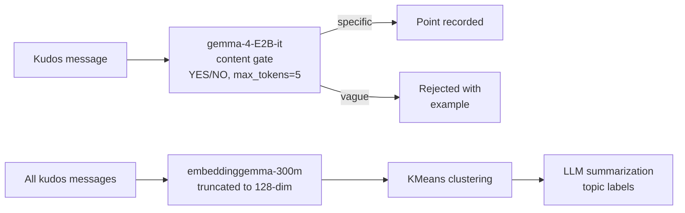

# Kudos Bot

Peer recognition programs fail when they're hard to use or easy to game. *Kudos Bot* makes giving praise as simple as a Slack message — and makes abuse structurally impossible rather than policy-dependent.

# The Problem

# Design Principles

# Reciprocity: You Earn by Giving

Points convert to dollars only when your given count matches your received count.

$$\text{owed} = \min(\text{given},\, \text{received}) - \text{redeemed}$$

|       | Given | Received | Redeemed | Owed |
|-------|------:|---------:|---------:|-----:|
| Alice |     5 |        3 |        2 |    1 |
| Bob   |     1 |        8 |        1 |    0 |

Bob has 7 unredeemed kudos. He earns his next payout by recognizing someone else.

# Anti-Abuse: Defense in Depth

- Rate limits and public channels prevent reciprocal farming
- LLM gate produces a written record that praise was substantive — if a claim is false, the org won't be liable

# Budget Control

Monthly point budget and conversion rate set by accounting. Over-budget kudos are marked as overflow — payout opportunity lost.

|       | Time  | Given | Received | Budget Remaining | Redeemed |
|-------|-------|------:|---------:|-----------------:|---------:|
| Alice | 10:00 |     3 |        2 |                5 |        2 |
| Bob   | 10:05 |     2 |        3 |                3 |        2 |
| Alice | 11:00 |     4 |        3 |                1 |        3 |
| Bob   | 11:05 |     3 |        4 |                0 |        2 |

Bob's 3rd kudos arrived after the budget was exhausted — it overflows and he earns nothing despite being owed.

# Demo: Slack Bot

Live demo: onboarding, content check, edit-to-fix, error handling, and private channel rejection.

# Demo: Dashboard

Live demo: operational snapshot, usage & budget forecast, treatment effect plot, leaderboard, and topic drill-down.

# Architecture

All business logic lives in Postgres functions. The Python app is a 150-line event router.

Edits delete the old point and re-evaluate from scratch. Deletions remove the point.

# Scheduled Jobs

| Script | Frequency | Purpose |
|--------|-----------|---------|
| `accounting.py` | Monthly | Report last month's redemptions to accounting channel |
| `weekly_reminder.py` | Weekly | DM users who haven't given kudos |
| `backfill.py` | Weekly | Embed kudos, cluster, LLM-summarize topics |
| `record_users.py` | Weekly | Record covariates for Poisson GLM |

# Treatment Effect Estimation

- Pairwise IRR between consecutive conversion-rate periods
- Redeemed counts $Y_j$, exposures $E_j = \sum (\text{workday\_frac} \times \text{num\_users})$

$$\text{IRR} = \frac{Y_2 / E_2}{Y_1 / E_1} \qquad \text{CI via score test inversion (Gu et al.)}$$

- 90% confidence intervals on each IRR
- Forecast: Poisson prediction scaled by next week's exposure

# Topic Clustering

Kudos messages are embedded into 128-dim vectors using a truncated embedding model, then clustered with KMeans using inverse-log month-frequency weights so older high-volume months don't dominate.

$$w_i = \frac{1}{\ln(1 + c_{m_i})} \qquad k = n_{\text{months}} + 3$$
Representative messages (nearest 25% to centroid) are sampled and summarized by an LLM into topic labels. 

# Technology Stack

\begin{center}
\begin{tabular}{c@{\hspace{1.2em}}c@{\hspace{1.2em}}c@{\hspace{1.2em}}c@{\hspace{1.2em}}c}
\includegraphics[height=1.2cm]{logos/slack.png} &
\includegraphics[height=1.2cm]{logos/postgres.png} &
\includegraphics[height=1.2cm]{logos/python.png} &
\includegraphics[height=1.2cm]{logos/dash.png} &
\includegraphics[height=1.2cm]{logos/statsmodels.png} \\[4pt]
\small Slack & \small Postgres & \small Python & \small Dash & \small statsmodels \\[14pt]
\includegraphics[height=1.2cm]{logos/sklearn.png} &
\includegraphics[height=1.2cm]{logos/llamacpp.png} &
\includegraphics[height=1.2cm]{logos/gemma.png} &
\includegraphics[height=1.2cm]{logos/pgsd.png} & \\[4pt]
\small scikit-learn & \small llama.cpp & \small Gemma & \small pg-schema-diff &
\end{tabular}
\end{center}

# Lines of Code

832 lines total — bot, dashboard, cron jobs, schema, and all business logic.

| Component | Lines |
|-----------|------:|
| Python    |   630 |
| SQL       |   202 |
| **Total** | **832** |

# AI in Development

AI was used at every stage: critiquing the initial design, generating synthetic data (usernames, kudos messages, topic distributions), prototyping all code, tests and debugging, learning unfamiliar libraries (Dash), and writing this presentation.

# AI in the Product

The bot uses an LLM to gate every kudos for substantive content, and another to summarize topic clusters for the dashboard.
