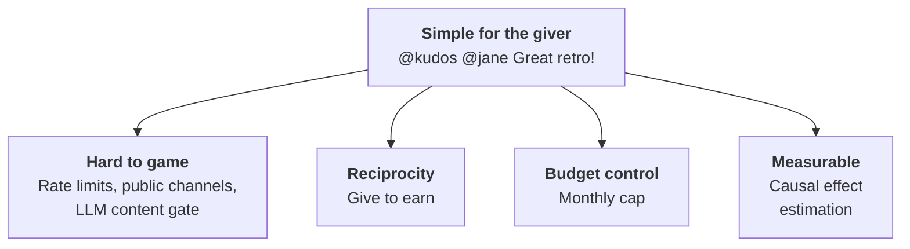
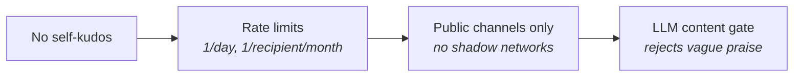
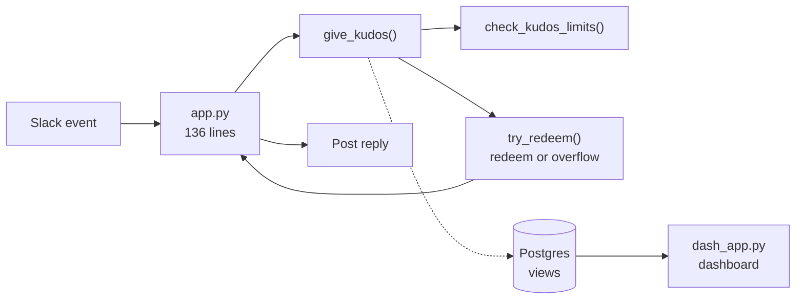
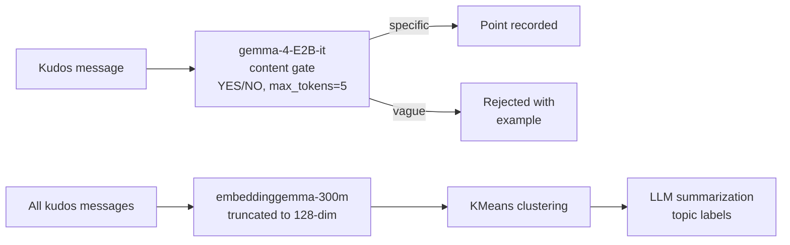

# Kudos Bot

\begin{columns}[T]
\begin{column}{0.43\textwidth}
\includegraphics[width=\textwidth]{screenshots/welcome.png}\\[6pt]
\includegraphics[width=\textwidth]{screenshots/llm_gate.png}
\end{column}
\begin{column}{0.43\textwidth}
\includegraphics[width=\textwidth]{screenshots/basic_message.png}\\[6pt]
\includegraphics[width=\textwidth]{screenshots/no_private.png}\\[6pt]
\includegraphics[width=\textwidth]{screenshots/accounting.png}
\end{column}
\end{columns}

# Features

# Reciprocity: You Earn by Giving

Your Nth give redeems your Nth received kudos — paired 1:1, oldest first.
Giving kudos is not just altruistic — it's how you unlock your own earnings.

$$\text{owed} = \min(\text{given},\, \text{received}) - \text{redeemed}$$

|       | Given | Received | Redeemed | Owed |
|-------|------:|---------:|---------:|-----:|
| Alice |     5 |        3 |        2 |    1 |
| Bob   |     1 |        8 |        1 |    0 |

Bob has 7 unredeemed kudos. He earns his next payout by recognizing someone else.

# Anti-Abuse: Defense in Depth

- Rate limits and public channels prevent reciprocal farming
- LLM gate produces a written record that praise was substantive — if a claim is false, the org won't be liable

# Budget Control

Monthly point budget and conversion rate set by accounting. Over-budget kudos are marked as overflow — payout opportunity lost.

|                | Time  | Given | Received | Budget           | Redemption |
|----------------|------:|------:|---------:|-----------------:|-----------:|
| Alice Gave     | 10:00 |     2 |        2 |                3 |          1 |
| Bob Received   | 10:00 |     3 |        3 |                2 |          1 |
| Alice Gave     | 11:00 |     3 |        3 |                1 |          1 |
| Bob Received   | 11:00 |     4 |        4 |                0 |          0 |

Bob's second receipt arrived after the budget was exhausted — it overflows and he earns nothing despite otherwise being owed.

# Dashboard Demo

Live demo: operational snapshot, usage & budget forecast, treatment effect plot, leaderboard, and topic drill-down.

# Architecture

All business logic lives in Postgres functions, wrapped in Python with slack-bolt. 48 automated tests cover all business logic. Edits delete the old kudos (un-redeeming linked points) and re-evaluate from scratch. The dashboard uses Plotly Dash.

# Scheduled Jobs

| Script | Frequency | Purpose |
|--------|-----------|---------|
| `accounting.py` | Monthly | Report this month's redemptions to accounting channel |
| `weekly_reminder.py` | Weekly | DM users who haven't given kudos |
| `backfill.py` | Weekly | Embed kudos, cluster, LLM-summarize topics |
| `record_users.py` | Weekly | Record exposures for Poisson GLM |

# Treatment Effect Estimation

- Pairwise IRR between consecutive conversion-rate periods
- Kudos counts $Y_j$, exposures $E_j = \sum (\text{workday\_frac} \times \text{num\_users})$

$$\text{IRR} = \frac{Y_2 / E_2}{Y_1 / E_1} \qquad \text{CI via binomial test inversion}$$

- 90% confidence intervals on each IRR
- Forecast: Poisson prediction scaled by next week's exposure

# Topic Clustering

Kudos messages are embedded into 128-dim vectors using a truncated embedding model, then clustered with KMeans using inverse-log month-frequency weights so older high-volume months don't dominate.

$$w_i = \frac{1}{\ln(1 + c_{m_i})} \qquad k = n_{\text{months}} + 3$$
Representative messages (nearest 25% to centroid) are sampled and summarized by an LLM into topic labels. Managers can see what behaviors are being recognized and how themes shift over time.

# Demo: Diagnostics Notebook

Live demo: Poisson model diagnostics (quantile residuals, overdispersion, autocorrelation) and cluster diagnostics (elbow plot, silhouette scores, stability).

# Technology Stack

\begin{center}
\begin{tabular}{c@{\hspace{1.2em}}c@{\hspace{1.2em}}c@{\hspace{1.2em}}c@{\hspace{1.2em}}c}
\includegraphics[height=1.2cm]{logos/slack.png} &
\includegraphics[height=1.2cm]{logos/postgres.png} &
\includegraphics[height=1.2cm]{logos/python.png} &
\includegraphics[height=1.2cm]{logos/dash.png} &
\includegraphics[height=1.2cm]{logos/statsmodels.png} \\[4pt]
\small Slack & \small Postgres & \small Python & \small Dash & \small statsmodels \\[14pt]
\includegraphics[height=1.2cm]{logos/sklearn.png} &
\includegraphics[height=1.2cm]{logos/llamacpp.png} &
\includegraphics[height=1.2cm]{logos/gemma.png} &
\includegraphics[height=1.2cm]{logos/pgsd.png} & \\[4pt]
\small scikit-learn & \small llama.cpp & \small Gemma & \small pg-schema-diff &
\end{tabular}
\end{center}

# Lines of Code

878 lines total — bot, dashboard, cron jobs, schema, and all business logic.

| Component | Lines |
|-----------|------:|
| Python    |   677 |
| SQL       |   201 |
| **Total** | **878** |

# AI in Development

- Critiquing the initial design
- Generating synthetic data (usernames, kudos messages, topic distributions)
- Prototyping all code and documentation (including this presentation)
- Tests and debugging
- Code review and critique

# AI in the Product

The bot uses an LLM to gate every kudos for substantive content, and another to summarize topic clusters for the dashboard.

# Deployment

Single Docker container runs `systemd` as PID 1 with everything inside.

| Unit | Description |
|------|-------------|
| `postgresql.service` | Postgres with pgvector |
| `kudos-bot.service` | Slack bot via Socket Mode |
| `kudos-dashboard.service` | Gunicorn on port 8050 |
| `kudos-backfill.timer` | Weekly embedding + clustering |
| `kudos-weekly-reminder.timer` | Weekly DM reminders |
| `kudos-accounting.timer` | Monthly redemption report |

Schema migrations via `pg-schema-diff` — declarative SQL, no migration files.

# Questions?

- One Slack message to give kudos — no forms, no approvals
- Anti-abuse enforced structurally, not by policy
- Reciprocity to encourage participation
- Causal measurement of budget impact on activity
- 845 lines of code, 48 tests including browser automations
